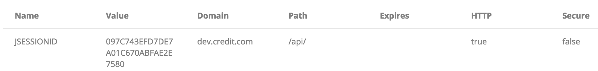

# Cookie扫盲贴

## 1. Cookie 的比喻
我们做个比喻，很久以前，味多美只卖面包和蛋糕，不卖小饼干，有一天西二旗区域的5家味多美，突发奇想要开始卖小饼干，所以联合搞了一个推广活动，本月充值买小饼干卡，享受5折优惠。店长们设计了这么一种卡：

0. 每张卡是唯一的，卡里面存了余额
1. 仅限西二旗区域的5家味多美使用
2. 仅限小饼干类
3. 有效期1个月
4. 仅限到店使用，外卖不可以使用此卡
5. 实名制，避免卡丢失或被盗

用任意一个查看Cookie的工具都能看到Cookie的这几个属性，如图：



后来有个在西二旗附近上班的码农，发现用这个来解释 Cookie 正合适：

0. 采用 Name = Value 的键值对形式存储数据，Name是唯一的
1. Domain 域名，限制哪些域名下可以使用
2. Path 路径，只有这个路径前缀的才让用
3. Expires 过期时间
4. HTTPOnly 只有浏览器请求时，才会在请求头中带着，JavaScript无法读写
5. Secure 非HTTPS请求时不带

继续往下比喻，还可以理解更多，比如删除非*HTTPOnly*的*Cookie*有两种方式：

1. 调用*JavaScript*在客户端删除*Cookie*，相当于你自己一把火把卡烧了，此时味多美不知道你烧掉了
2. HTTP **Response** Header里删除，相当于你到店的时候正好消费完了，味多美就把卡给回收了，你要不去店里消费（没有**Request**），就无法用到这个方式

## 2. Cookie是基于HTTP请求和响应的
响应头
```
Set-Cookie: JSESSIONID=097C743EFD7DE7A01C670ABFAE2E7580; Path=/api/; HttpOnly
```

请求头（第二次请求就可以带着以前种的*Cookie*）

```
Cookie: JSESSIONID=097C743EFD7DE7A01C670ABFAE2E7580
```

注意：这里不需要把*Cookie*的任何属性在请求头里带给服务端。

## 3. 关于Cookie的伪造与安全
因为HTTP协议是无状态的，本身只负责传输数据这件事情，别的都不管。

所以遵守游戏规则（Cookie的所有属性）的职责就落到浏览器身上了，浏览器有统称为“安全沙箱”的机制来实现安全。

因此你要做一个浏览器，不遵守这些游戏规则是可以的。事实上用 cURL、Postman等工具都可以随意构造Cookie，这个层次的安全则要应用程序自行来保障。

## 4. 理解Session
上面的例子已经讲完了Session的概念了，虽然你没看到Session这个词。

上面的例子也包含了这么一层意思：味多美每来一个希望参与活动的无卡用户，都分配一个新卡（不区分是第一次办理，还是丢失后重办一张）。我们假设每个用户都是理智的，就会最多持有一张卡，那么那张卡相当于标识了一个用户身份。味多美自己会存储每张卡的数据，而不是把数据存在卡里面。
这么做是为了避免这种悲剧重演：

```
杨某和林某案发前均为奇虎360公司的网络工程师。
去年12月底，杨某发现本市市政一卡通充值系统存在漏洞。
他用自己的卡片试验，并破解了卡内芯片带有的系统密码，发现自己可随意改动卡内金额。
```
参考：[奇虎360员工破解北京公交一卡通被拘役](http://shizheng.xilu.com/20140104/1000150000503486.html) 

所以简单说：**Session就是给用户发一个身份凭证，然后在服务端存储（重要）数据，客户端只存储身份凭证，这样数据安全才有保障，这个事情称为Session，这个事情与Cookie没半毛钱关系。**Cookie是Session传递的载体而已，早期2G网关不支持Cookie时，WAP站点一般在URL中直接带JSESSIONID来传递，同样实现了Session。现在2G很少用了，几乎提到Session必然都是以Cookie为载体的。所以我理解的是：

```
Cookie是Session的一种载体。
```

## 5. 为什么 JSESSIONID 每次都是新的/(ㄒoㄒ)/~~

通常是应为后续请求没有带着以前服务端返回的 JSESSIONID 。

这就好比：店家活动没设计对，在西二旗店只能办西三旗店的卡，你办完发现现在不能用，于是你决定再办一张，你办完发现现在不能用，于是你决定再办一张，你办完发现现在不能用...o(╯□╰)o

1. Path不一样，切记 Nginx 转发的时候 Path 要对应上，不能差一定点，或者把 Path 显示设置为 / （所有）
2. Ajax跨域（这个是浏览器限制的，Postman无此问题），可以设置`XHR. withCredentials = true`解决此问题

遇到这种问题的时候，请理解`Cookie是基于HTTP请求和响应的`，通过抓包工具一看就明白了。

